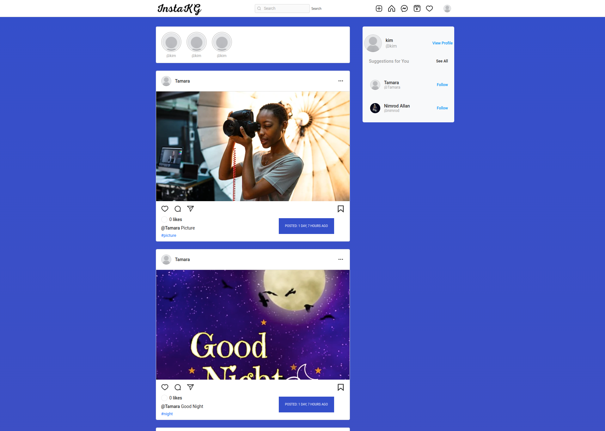

## Django InstaKG Social Web App

InstaKG is a social media web application built to mimic the functionalities of Instagram. Users are required to signup before they start using the application. The application is developed using Python, Django, Bootstrap 5 and JavaScript

## Project Preview

## Application User Stories

As a user of the application I should be able to:

1. Sign in to the application to start using.
2. Upload my pictures to the application.
3. See my profile with all my pictures
4. Follow other users and see their pictures on my timeline.
5. Like a picture and leave a comment on it.
   
## Tech Stack Used

1. Python / Django - Backend
2. Bootstrap5/ Html5/JavaScript/CSS3 - Frontend
3. PostgreSQL - Backend(Database)

## Setup & Installation 

### Prerequisites
- python3.8
- Django 4
- PostgreSQL
- Virtual environment
- requirements.txt

### Cloning and Using the Application
In your terminal:

1. $ git clone git@github.com:bignimz/Django-instakg.git
2. pip install -r requirements.txt
3. create a new virtual environment (virtual)
4. run python manage.py runserver    

## Known Bugs

Currently there is one bug in sending welcome email to users once they signup, but pull requests are allowed incase you spot any other bug

## Contribution

Pull requests are welcome. For major changes, please open an issue first to discuss what you would like to change.

Please make sure to update tests as appropriate.

## Project Author

Name: Nimrod Musungu  
Email: nimrod.chitayi@gmail.com 
Website: nimrodmusungu.com

## License [MIT]

Copyright 2022, Nimrod Musungu

Permission is hereby granted, free of charge, to any person obtaining a copy of this software and associated documentation files (the "Software"), to deal in the Software without restriction, including without limitation the rights to use, copy, modify, merge, publish, distribute, sublicense, and/or sell copies of the Software, and to permit persons to whom the Software is furnished to do so, subject to the following conditions:

The above copyright notice and this permission notice shall be included in all copies or substantial portions of the Software.

THE SOFTWARE IS PROVIDED "AS IS", WITHOUT WARRANTY OF ANY KIND, EXPRESS OR IMPLIED, INCLUDING BUT NOT LIMITED TO THE WARRANTIES OF MERCHANTABILITY, FITNESS FOR A PARTICULAR PURPOSE AND NONINFRINGEMENT. IN NO EVENT SHALL THE AUTHORS OR COPYRIGHT HOLDERS BE LIABLE FOR ANY CLAIM, DAMAGES OR OTHER LIABILITY, WHETHER IN AN ACTION OF CONTRACT, TORT OR OTHERWISE, ARISING FROM, OUT OF OR IN CONNECTION WITH THE SOFTWARE OR THE USE OR OTHER DEALINGS IN THE SOFTWARE.